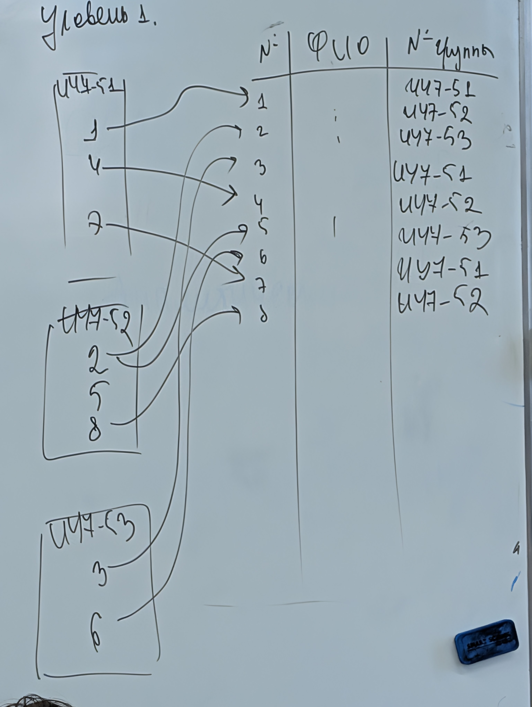
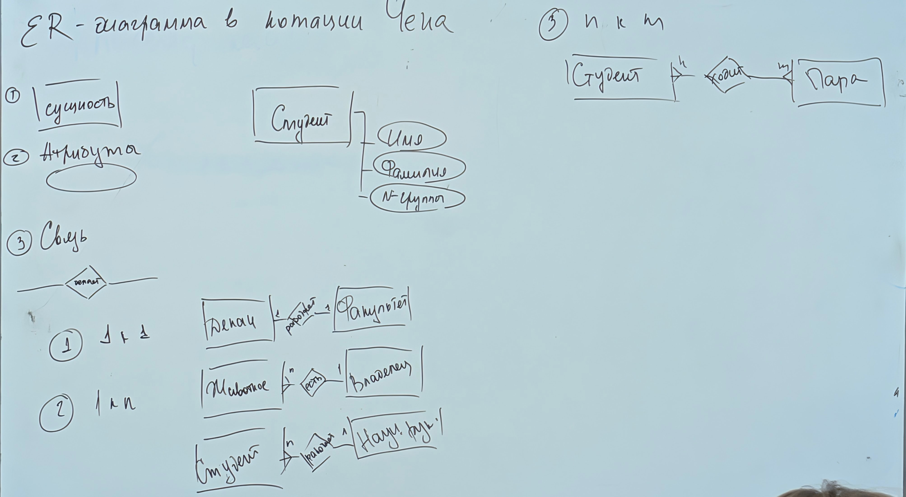
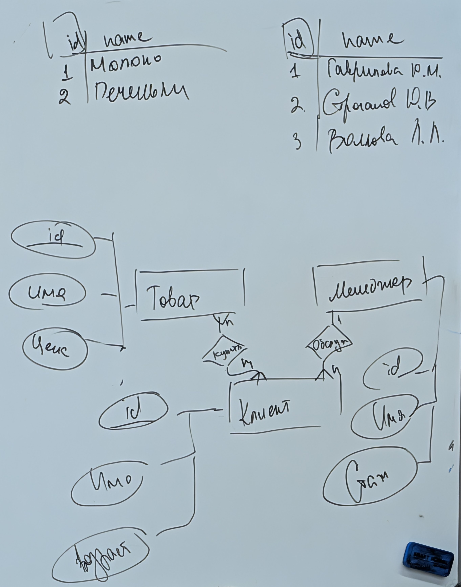

# Преподаватели

Строганов Д.В.
Шибанова Д.А.
Гаврилова Ю.М.

10 лабораторных работ
3 РК
1 Экз

# Закрытие модуля

- min баллов для РК
- сданы ~~10~~ 12 л/р

- Рк1 лекция на ~7 неделе (18-30)б теория + практика
- РК2 семинар (12-20)б практика
- РК3 семинар (12-20)б практика
- ЭКЗ (18-30)б

Стек работы:

- PostgreSQL
- Python или иное (Oracle+java для любителей сложностей)
- DBeaver для работы с несколькими DB

Базу данных можно ставить в docker, но туда же придется добавить Redis и т.д. ...

Концепция баз данных возникла в 60 годах, когда в одном файле хранить уже тяжело а в RAM не влезает.

Мы будем изучать **реляционные** базы данных (таблицы).

**База данных** - самодокументированное собрание интегрированных записей.

- самодокументированное - база данных содержит метки/метаданные, журналы.
- Интегрированные - вместе с метаданными

Требования к БД:

1. Неизбыточность - данные не должны дублироваться без пользы. \*не касается к бэкапов и жулналов.
2. Совместный доступ
3. Эффективность - быстродействие, минимальный отклик
4. Целостность - непротиворечивоть данных. нет висящих ссылок невалидных значений и т.д.
5. Безопасность
6. Восстановление после сбоев.
7. Независимость структур данных от прикладных программ

- БД - база данных - она _хранит_.
- СУБД - Система Управления Базами Данных, она _действует_. Это приложение, которое обеспечивает _работу_ с данными (`хранение`, `обновление`, `поиск`).

**Основные функции СУБД**:

1. Управление данными во внешней памати
2. Управление данными в оперативной памяти (буферы, кэши и т.д.)
3. Управление транзакциями
4. Журналирование
5. Поддержка языка (SQL)

**SQL** - Structured Query Lauguage. Еще и стандарт с 2011 года. Любая база данных должна их поддерживать.

В рамках курса мы изучим:

- SQL
- Реляционную модель
  - Теория множеств
  - Логика предикатов
- Потом PlpgSQL

SQL:

1. DDL (Data Definition Language) -> про объекты
   - создать `create`
   - удалить `drop`
   - изменить `alter`
2. DML (Data Manipulation Language) -> про данные
   - получить `select`
   - добавить `insert`/`copy`
   - удалить `delete`
   - очистить `truncate`
   - изменить `update`
3. DCL (Data Control Language) -> про права
   - выдать `grant`
   - отозвать `revoke`
   - запретить `deny`

# DDL

| a1  | a2  | a3  |
| :-: | :-: | :-: |
|  1  |  2  |  3  |
|  4  |  5  |  6  |
|  7  |  8  |  9  |

~~Столбец~~ -> Атрибут\
~~Строка~~ -> Кортеж\
~~Таблица~~ -> Отношение\
У ~~столбцов~~ нет номеров\
{1, 1, 2} = {1, 2}\
{2, 1} = {1, 2}

Множество всех ~~столбцов~~ - заголовок \
Множество всех ~~строк~~ -> тело отношения

## Способы хранения данных

1. Таблица `table`
2. Временная таблица `temp table`
3. Представление `view` - хранит не данные а запросы, поэтому при образении к `view` оно превращается в другие запросы.
4. Материлизованное представление `materialised view`.
5. Табличная переменная, создать через `declare`.
6. Индексированное представление `index`.

```sql
create table [БД,][схема.]имя_таблицы (             -- public.table1
    <имя_атрибута тип_атрибута [ограничения][,]>+
    [ограничеие на таблицу]
)
[способы хранения данных]
;
```

| OLTP - OnLine Transaction Processin | OLAP - OnLine Analythical Processing                        |
| ----------------------------------- | ----------------------------------------------------------- |
| Операционные данные                 | Перманетные данные <br> (аналитические, децентрализованные) |
| t_write/insert/delete -> min        | t_select -> min                                             |
| 3НФ                                 |                                                             |

Часто типы хранения вложены для компромиса

БД включает в себя и аппаратное и программное обеспечение.
СУБД - программное обеспечение для высокоуровневого оперирования данными.
В БД есть пользователи:

- Администраторы
- Не привилегированные пользователи (люди/программы)

Классификация баз данных

1. По модели храниия:
   - Дореляционные модели
     - Инвертированные списки 
     - Иерархические модели
     - Сетевая модель
   - Реляционная модель
   - Постреляционные модели
2. По архитектуре организации данных
   - Локальная `postgres`, `oracle`, `mssql` ...
   - Распределенная `vertica`, `greenplum`, `clickhouse` ...
3. По способу доступа
   - Файл-серверная архитектура
     - Microsoft Access
     - Excel
   - Клиент-серверная архитектура - клиент делает запрос, бд возвращает в ответ ровно столько, сколько запрошено. `postgreSQL`, `oracle`, `mssql` ...
   - Встраиваемые СУБД - библиотека. `REDIS`, `sqLite` ...
   - Сервисо-ориентированные БД - оспользуется для коммуникаций между приложениями и т.д. `Kafka`, `RabbitMQ`
   - Прочие.

## Нотация Чена

ER - Entiti-Relationship. Сущность-связь \


